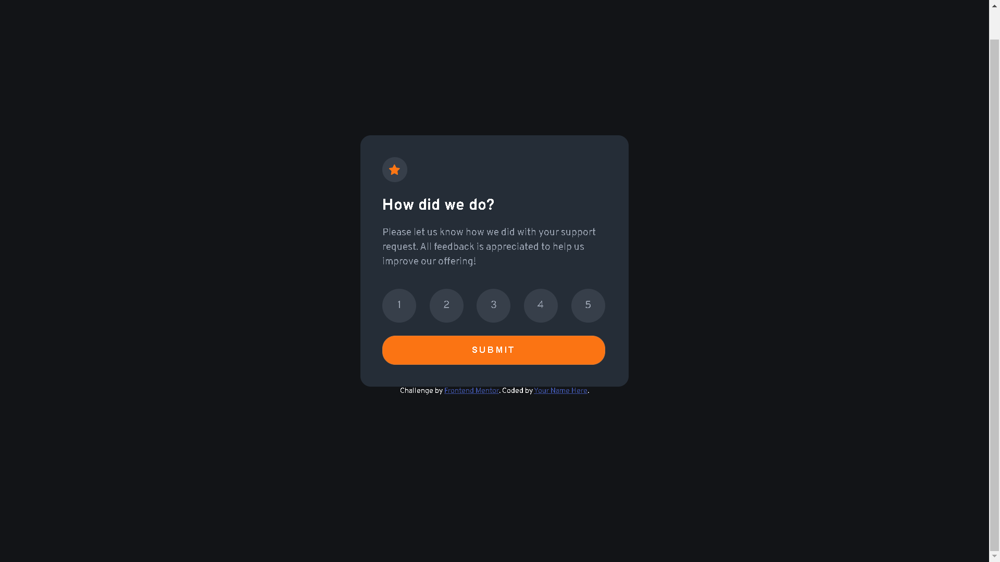

## Table of contents

- [Overview](#overview)
  - [Screenshot](#screenshot)
- [My process](#my-process)
  - [Built with](#built-with)
  - [What I learned](#what-i-learned)
- [Author](#author)

## Overview

### Screenshot



## My process

### Built with

- Semantic HTML5 markup
- Flexbox
- Mobile-first workflow

### What I learned

```js
function getNumbers() {
    for (let i = 0; i < numbers.length; i++) {
        numbers[i].addEventListener("click", function () {
            numbers[i].className = "checked mousePointer";
            
            for (let a = 0; a < numbers.length; a++) {
                if (a == i ) {
                    continue;
                }

                numbers[a].className = "unchecked mousePointer";
                numClick = i + 1;
            }

        })

    }
}
```
## Author

- Frontend Mentor - [@Theuz1nh0](https://www.frontendmentor.io/profile/Theuz1nh0)